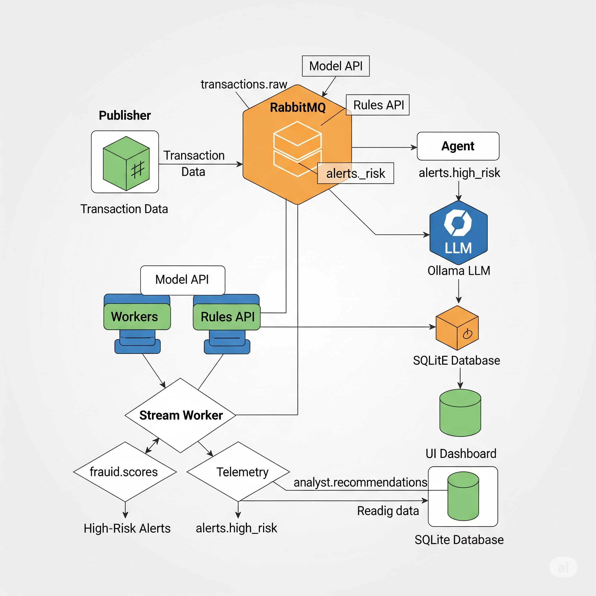

# Real-Time Agentic AI Fraud-Detection Demo

An end-to-end demo that streams transactions, scores them with a model + rules, and uses an **LLM Agent** to turn high-risk events into **explainable decisions** stored for a **UI dashboard**.

---

## Architecture




**Flow summary**

1. **Publisher** (`scripts/publish_sample.py`) reads `data/transactions_sample.jsonl` and publishes to RabbitMQ → **`transactions.raw`**.  
2. **Stream Worker** consumes, computes **online features**, calls **Model API** (score + **top factors**) and **Rules API** (fired rules).  
   - Emits telemetry → **`fraud.scores`**.  
   - Computes a **baseline decision** (what the pipeline would do *without* the Agent).  
   - If `baseline_decision ∈ {step_up, block}`, publishes enriched alert (with **ground truth** + **top factors**) → **`alerts.high_risk`**.  
3. **Agent** consumes alerts, fetches brief history, calls **LLM** for a structured **recommendation** (or uses **policy fallback**), writes alerts & recommendations to **SQLite** (`data/fraud.db`), and publishes to **`analyst.recommendations`**.  
4. **UI (Streamlit)** reads `data/fraud.db` and shows **Baseline vs Agent** vs **Ground Truth** with explanations.

**Queues (RabbitMQ)**

- `transactions.raw` → ingest  
- `fraud.scores` → telemetry  
- `alerts.high_risk` → to Agent  
- `analyst.recommendations` → Agent output

**Ports**

| Service            | Port  | Notes                                                 |
|--------------------|------:|-------------------------------------------------------|
| RabbitMQ (AMQP)    |  5672 | broker                                               |
| RabbitMQ Mgmt UI   | 15672 | http://localhost:15672 (guest/guest)                 |
| Model API          |  8001 | `/health`, `/features`, `/score`                     |
| Rules API          |  8002 | `/health`, `/eval`                                   |
| UI (Streamlit)     |  8501 | dashboard                                            |
| LLM (Ollama)       | 11434 | if running locally                                   |

---

## What the Agent Adds (and why)

- **Actionable decisions**: converts score + rules + short history into `allow / step_up / block` with **rationale & actions**.
- **Explainability**: uses Model API **top contributing features**; strict JSON validation.
- **Resilience**: if the LLM is down/invalid, falls back to **policy thresholds** (from `config/decision_policy.json`).
- **Auditability**: persists everything in **SQLite** (`data/fraud.db`) which the UI reads.

Without the agent, the **baseline pipeline** (score + rules) yields a `baseline_decision`. The Agent may agree—or escalate/de-escalate—with an explanation.

---

## Repository Layout (key paths)

infra/docker-compose.yml # services & wiring
data/raw/PaySim.csv # source data
data/transactions_sample.jsonl # streaming input file (generated)
artifacts/ # model.pkl + model_config.json (generated)
services/
model_api/ # FastAPI model scoring + top_factors explain
rules_api/ # YAML-driven rules
stream_worker/ # consume → features → score+rules → alerts
agent/ # LLM/policy → SQLite + recommendations
ui/ # Streamlit dashboard (reads data/fraud.db)
scripts/
prepare_paysim.py # CSV → JSONL
train_artifacts.py # train model → artifacts/
evaluate_artifacts.py # metrics / thresholds
publish_sample.py # publish JSONL to RabbitMQ


```
# 1) Local deps for helper scripts
make venv install

# 2) Build a streaming file from PaySim
make prepare-data

# 3) Train model artifacts (so scores aren’t 0.0), then reload Model API
make train
docker compose -f infra/docker-compose.yml restart model_api

# 4) (Re)build & start services (Worker/Agent/Model/Rules/Rabbit/UI)
make compose-up

# 5) If you use a local Ollama on Colima, set this once in compose (agent.env):
# OLLAMA_URL=http://host.lima.internal:11434/api/chat
# …then restart just the agent
docker compose -f infra/docker-compose.yml up -d --build agent

# 6) Publish events into the pipeline
make publish

# 6.5) Clear queues + DB, then restart consumers
make soft-reset

# 7) Tail logs to watch processing
make logs   # Ctrl-C to exit

# 8) Open the dashboard
open http://localhost:8501
```

## LLM Setup (Agent)

- Docker Desktop: OLLAMA_URL=http://host.docker.internal:11434/api/chat
- Colima: OLLAMA_URL=http://host.lima.internal:11434/api/chat

On your host:
```
ollama serve
ollama pull llama3.1:8b
```

The Agent automatically falls back to policy thresholds if the LLM is unreachable or returns invalid JSON.

## Data & Ground Truth

PaySim columns carried into the stream (and UI):

- `amount`, `nameOrig` (→ `user_id`), `nameDest` (→ `merchant`)
- `oldbalanceOrg`, `newbalanceOrig`, `oldbalanceDest`, `newbalanceDest`
- `isFraud` (ground truth), `isFlaggedFraud` (dataset’s “flagged” rule)

Worker adds:

- `baseline_decision`: what pipeline would do without the Agent (allow/step_up/block)
- `model_top_factors`: top contributors from Model API (/score explain)
- `features`, `score`, `reasons` (fired rule IDs), `threshold`

#### Alert example (`alerts.high_risk`)
```
{
  "txn_id": "…",
  "ts": "2025-08-01T12:00:00Z",
  "user_id": "C123",
  "merchant": "M45",
  "amount": 129.90,
  "features": { "...": 0.0 },
  "score": 0.86,
  "reasons": ["ip_country_mismatch"],
  "threshold": 0.75,
  "baseline_decision": "step_up",
  "model_top_factors": [
    {"feature": "log_amount", "contribution": 1.12}
  ],
  "isFraud": 1,
  "isFlaggedFraud": 0,
  "oldbalanceOrg": 5000,
  "newbalanceOrig": 4870,
  "oldbalanceDest": 0,
  "newbalanceDest": 130
}
```

### UI Dashboard (what you’ll see)

- Recent Alerts with: score, rules, Baseline vs Agent decisions, ground truth, balances.
- Explain: top model factors per alert (from Model API).
- Aggregate: Baseline vs Agent precision/recall/F1 on labeled alerts processed so far.
- Reads from data/fraud.db (populated by the Agent).

### APIs
#### Model API

- `GET /health` → `{status: ok|error, features:[...] }`
- `GET /features` → list of expected features
- `POST /score` with `{"features": {...}}`

    - Response:
```
{
  "score": 0.83,
  "features": ["..."],
  "explain": {
    "bias": -3.27,
    "contribs": {"log_amount": 1.12, "hour_mod_24": -0.08},
    "top_factors": [
      {"feature": "log_amount", "contribution": 1.12}
    ]
  }
}
```

#### Rules API

- `POST /eval` with `{"features": {...}}` → `{"fired": ["rule_id", ...]}`

### Configuration

- `config/decision_policy.json` → Agent fallback thresholds (`tau`, `tau_high`)
- `config/rules.yaml` → rule definitions (IDs returned as `reasons`)
- `infra/docker-compose.yml` → service env vars (thresholds, URLs, mounts)

#### Common env vars

- `ALERT_THRESHOLD` (Worker) — base `tau`
- `ALERT_THRESHOLD_HIGH` (Worker) — default `tau + 0.15`
- `DB_PATH` (Agent) — default `/data/fraud.db`
- `POLICY_PATH` (Agent) — default `/app/config/decision_policy.json`
- `MQ_HOST`, `MQ_USER`, `MQ_PASS`,`MQ_VHOST` — broker settings (default vhost `/`)

### Troubleshooting

- Dashboard empty
    - `make publish`; tail logs: `make logs`
    - Check queues:
    `docker compose -f infra/docker-compose.yml exec rabbitmq rabbitmqctl list_queues name messages`
    - Train artifacts + restart Model API:
    `make train && docker compose -f infra/docker-compose.yml restart model_api`
    - Lower `ALERT_THRESHOLD` (e.g., `0.2`) and rebuild the worker.

- Agent AMQP error: vhost not found
    - Ensure `MQ_VHOST` is unset or `/`. Code defaults to `/`.

- Agent LLM error: 404 `/api/chat`
    - On Colima use `host.lima.internal`; ensure `ollama serve` is running.

- No queues visible
    - They’re declared at first publish/consume. Run `make publish` or restart services.

- Scores are 0.0
    - Artifacts missing/not loaded. `make train` then restart Model API.

- Reset
    - `make soft-reset` → purge queues + wipe DB + restart consumers
    - `make nuke` → down + wipe DB + up -d --build

### Security / PII

This demo uses synthetic PaySim data. For real data, scrub PII, isolate secrets, and harden broker/UI access.

### Acknowledgements

- PaySim dataset authors (synthetic financial transactions)
- FastAPI, RabbitMQ, Streamlit, scikit-learn, Ollama